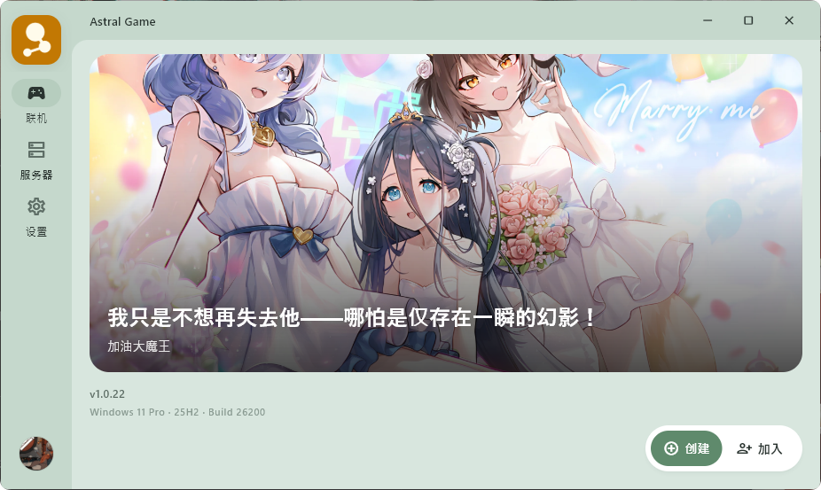
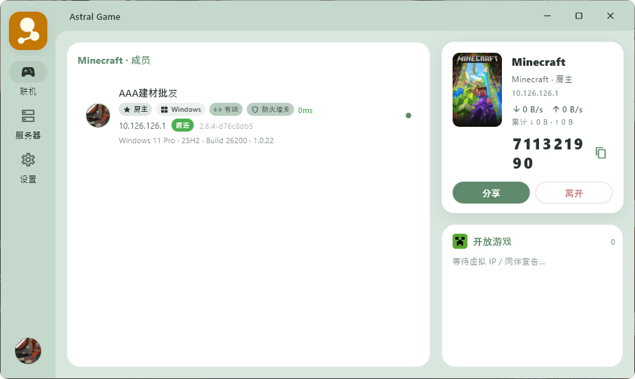

:::important
联机前请处理好防火墙。绝大多数「连不上 / 房间里看不到人」都和防火墙或安全软件拦截有关。
:::

## 使用前准备

1. 下载并安装 AstralGame https://next.astral.fan/game/
2. 启动后**添加一个可用服务器**

:::tip
服务器可以关注群或者QQ频道获取一些公益服务器。
:::

## 一、添加服务器

这一步不是必须的但是创建房间的人需要加入的可以没有。

1. 打开左侧 **服务器**
2. 点击右下角+图标
3. 填入名称和服务器地址

## 二、创建房间

1. 打开左侧 **联机**
2. 点击**创建**
3. 选择合适的游戏 不同的游戏会有不同的适配文件 如果找不到就选择其他 
4. 创建好房间后复制短码给好友 通常位9位或者一串字符串

## 三、加入房间（成员）

1. 打开 **联机** → 点加入
2. 填入分享的链接或者短码
3. 这样就可以了可以看到你的虚拟ip等相关内容
