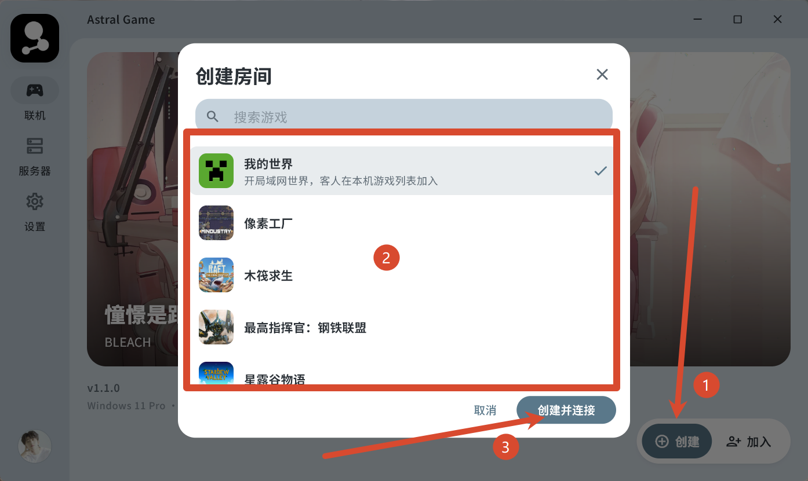
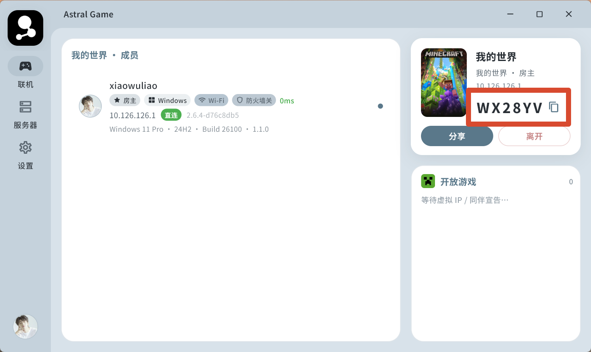
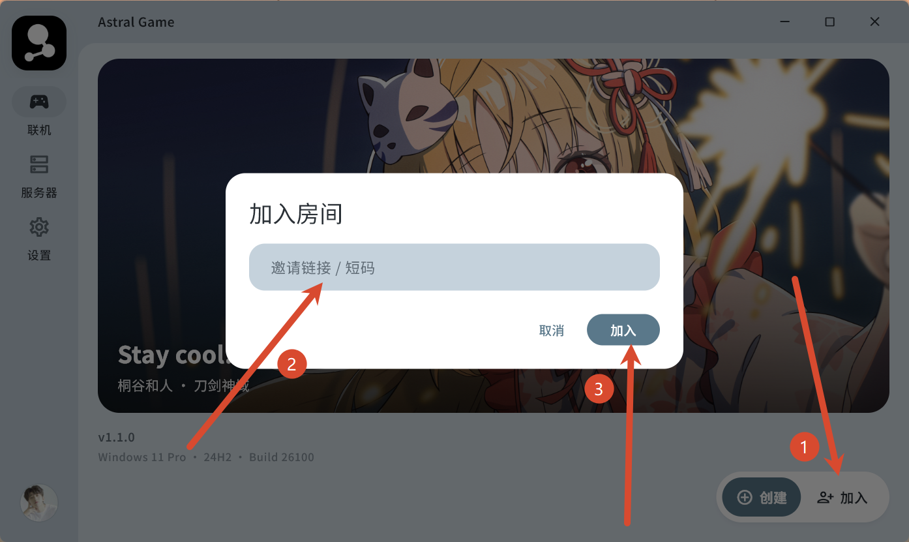
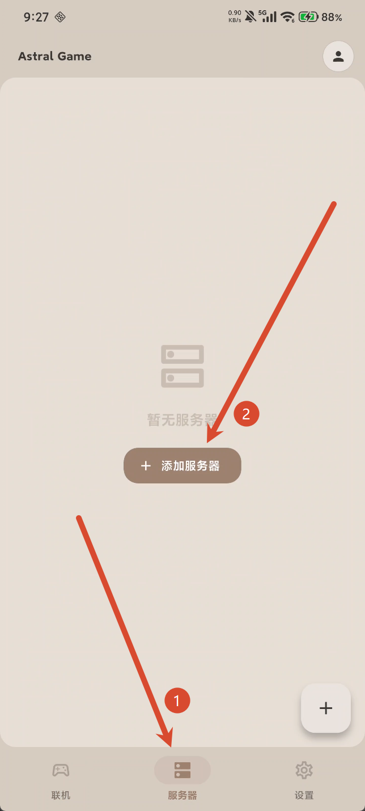
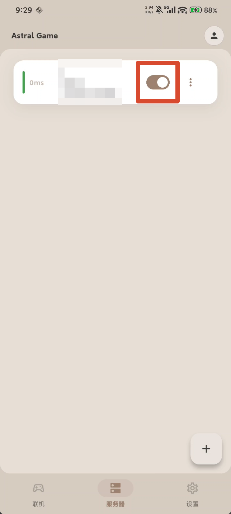
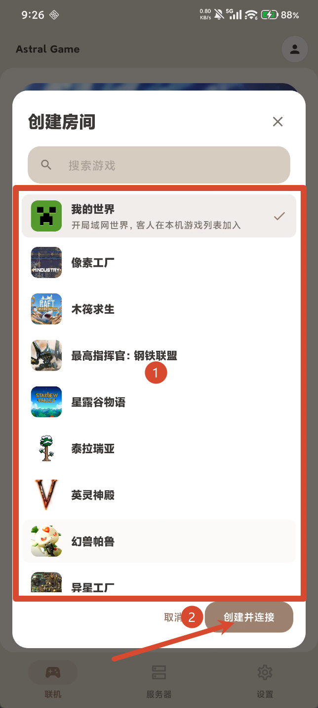
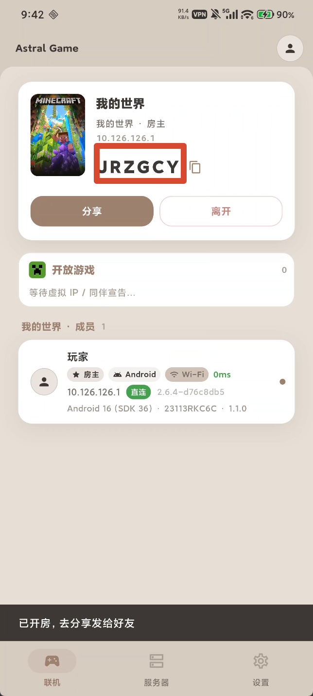
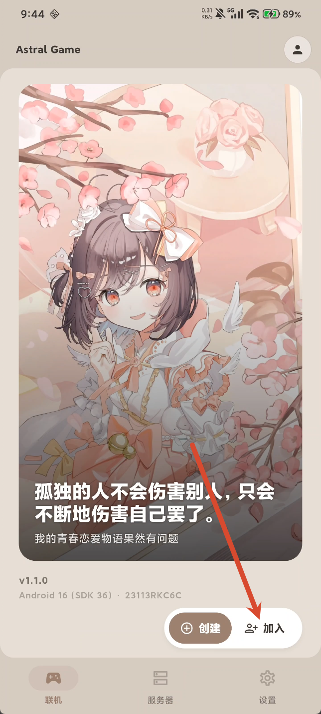
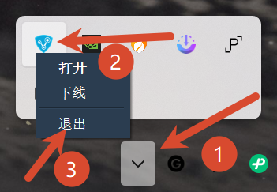

:::warning
如果你安装了**radmin**，**请提前退出该软件**，该软件可能会**影响astral-game的正常使用**，如果你不知如何正确退出，请看[这里](#怎么正确退出radmin)
:::

## 目录（您可以从目录跳转到相应的章节学习以节省您的时间，将宝贵的时间用于游戏中）

1. [电脑使用astral创建和加入房间](#电脑使用astral创建和加入房间)
2. [手机使用astral创建和加入房间](#手机使用astral创建和加入房间)

### 电脑使用astral创建和加入房间

#### 房主步骤

1. 来到astral-game主页，点击左侧的**服务器**，随后点击右下角的**加号**来添加服务器

:::tip
关于服务器在哪里找可以进[QQ群](https://qm.qq.com/q/DbxQAsjpce "群号：1106339751")中看群公告或者进入[频道](https://pd.qq.com/s/90vkmvwar)查找
:::

:::tip
关于服务器是否可用看[这里](https://acg-n.cn/posts/如何检查服务器在线状态和为什么联机很卡)
:::

2. 添加服务器后，记得在右侧**打开**以启用服务器

3. 点击右下角**创建**，在弹出的窗口中点击**你需要联机的游戏**，随后点击**创建并连接**即可

4. 分享右侧的短码给你的好友即可

:::tip
你可以在astral-game左下角点击头像，编辑头像和名称，这样可以在astral的房间页面中**更好的区分自己和他人**，另外如果**已经创建或加入了房间**需要**重新创建和加入**！
:::

#### 房员步骤

1. 在astral-game主页面点击右下角**加入**，输入房主发来的短码即可

:::tip
你可以在astral-game左下角点击头像，编辑头像和名称，这样可以在astral的房间页面中**更好的区分自己和他人**，另外如果**已经创建或加入了房间**需要**重新创建和加入**！
:::

### 手机使用astral创建和加入房间

#### 房主步骤

1. 来到astral-game主页，点击下方的**服务器**，随后点击中间的**添加服务器**

:::tip
关于服务器在哪里找可以进[QQ群](https://qm.qq.com/q/DbxQAsjpce "群号：1106339751")中看群公告或者进入[频道](https://pd.qq.com/s/90vkmvwar)查找
:::

:::tip
关于服务器是否可用看[这里](https://acg-n.cn/posts/如何检查服务器在线状态和为什么联机很卡)
:::

2. 添加服务器后，记得在右边**勾选**以启用服务器

3. 点击右下角**创建**，在弹出的窗口中点击**你需要联机的游戏**，随后点击创建并连接即可

4. 分享右侧的短码给你的好友即可

:::tip
你可以在astral-game的右上角点击头像，编辑头像和名称，这样可以在astral的房间页面中**更好的区分自己和他人**，另外如果**已经创建或加入了房间**需要**重新创建和加入**！
:::

#### 房员步骤（这里借图电脑端配置，因为差不多）

1. 在astral-game主页面点击右下角**加入**，输入房主发来的短码即可

:::tip
你可以在astral-game的右上角点击头像，编辑头像和名称，这样可以在astral的房间页面中**更好的区分自己和他人**，另外如果**已经创建或加入了房间**需要**重新创建和加入**！
:::

### 怎么正确退出radmin

1. 点击电脑桌面**右下角**的**小箭头**，找到**radmin的图标**，**右键图标**选择**退出**即可

---

> ## 🌟 Thanks for Reading
>
> **文章作者：** `xiaowuliao`  
> **网站作者：** `kevin`
>
> 感谢你的阅读与支持！
>
> 希望这篇 Astral 联机教程能够对你有所帮助。  
> 如果你在使用过程中遇到问题，欢迎反馈与交流。
>
> **感谢阅读 · 祝你联机愉快！** 🎮
>
> ---
>
> *Made with ❤️ by xiaowuliao · Website by kevin*

---