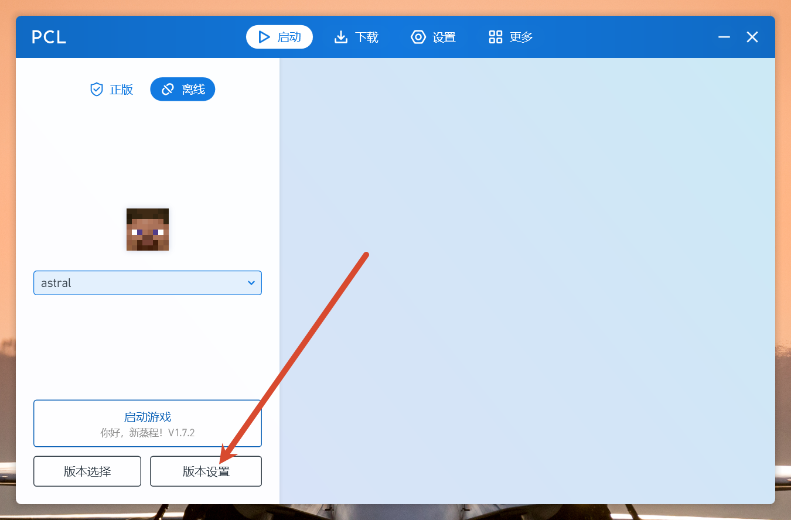
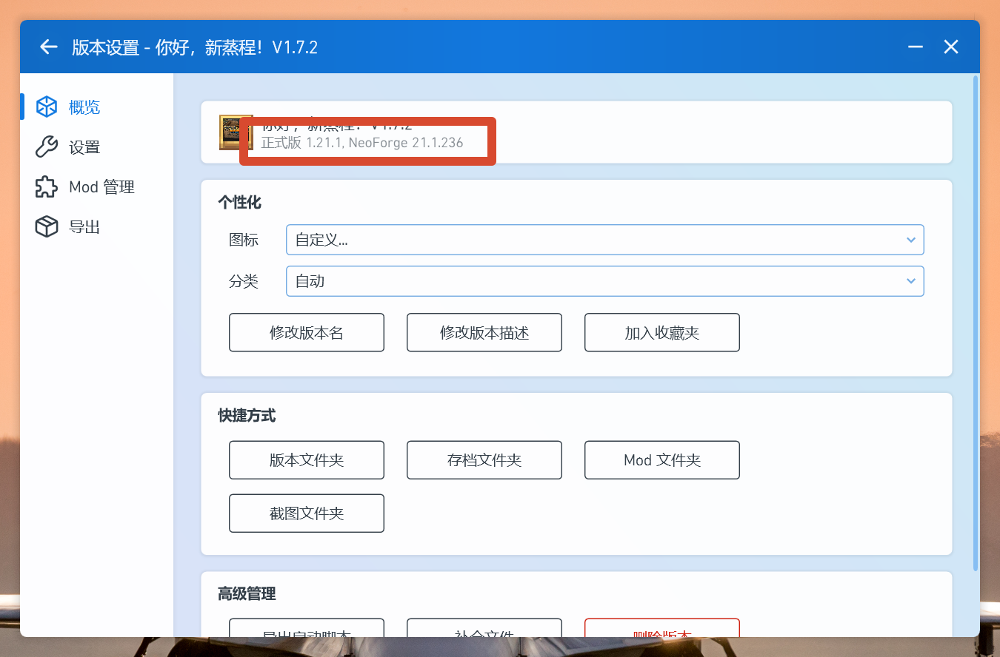
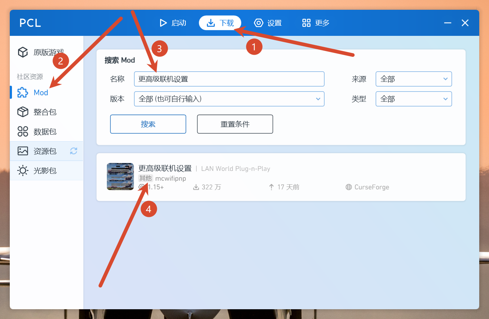
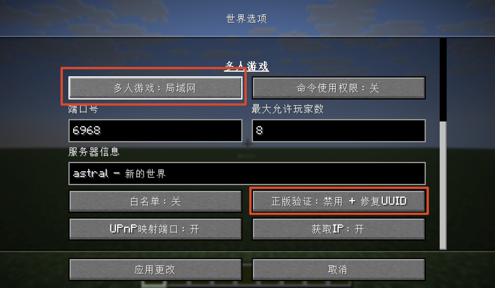
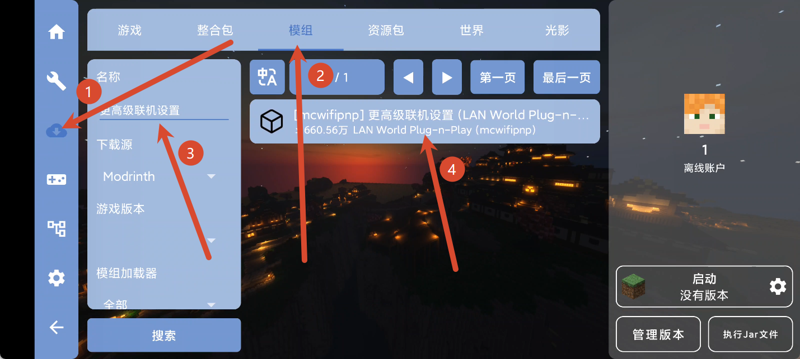

## 前情提要

:::important
该教程为astral-game的MC联机教程，包含手机和电脑端的MC联机模组安装，包含服务器的选择和卡顿原因以及解决的办法，带你品鉴MC的特色联机风味
:::

[下载并安装 AstralGame](https://next.astral.fan/game/)

## 目录（您可以从目录跳转到相应的章节学习以节省您的时间，将您宝贵的时间用于游戏中）

1. [电脑安装MC联机模组](#电脑安装MC联机模组)
2. [手机安装MC联机模组](#手机安装MC联机模组)


### 电脑安装MC联机模组

:::important
离线玩家房主必装，正版玩家可以跳过这个章节到[这里](https://acg-n.cn/posts/AstralGame使用教程)
:::

1. 确定你的联机的**游戏版本**和**加载器**，这里以**你好，新征程**整合包为例，点击**版本设置**



2. 进入后便可以看到**游戏版本**和**加载器**，比如我这里**游戏版本**为**1.21.1**，**加载器**为**neoforge**



3. 确定**游戏版本**和**加载器**后，点击左上角返回到PCL2主页面，点击**下载**，***Mod**，搜索**更高级联机设置**，随后点击模组进入模组下载页面

```md
更高级联机设置
```



4. 找到刚刚确定的**游戏版本**和对应的模组**加载器**，选择下载即可

:::tip
注意在**游戏版本**中**1.21.1**和**1.21.10**是**两个不同的游戏版本**（以此类推），在**加载器**中**neoforge**和**forge**是**两个不同的加载器**！
:::

:::tip
联机模组仅需房主安装，房员无需安装！
:::

5. 启动游戏，打开**对局域网开放**，并配置**如下红框**的设置即可,其他配置按**需要调整**，**请遵循不懂别乱动原则**

:::important
不同的游戏版本可能会导致配置页面有些许不同，您只需要配置**正版验证：禁用+修复UUID**即可
:::



6. 随后[配置astral-game](https://acg-n.cn/posts/AstralGame使用教程/#电脑使用astral创建和加入房间)

### 手机安装MC联机模组

1. 确定你联机的**游戏版本**和模组**加载器**~~（你都用手机玩JAVA版MC了我相信你会看的）~~

2. 这里以**FCL启动器**为例（其他启动器请自行摸索或百度），在**FCL启动器**的左侧点击**下载**，**模组**，搜索**更高级联机设置**，找到对应的**游戏版本**和**加载器**安装即可

```md
更高级联机设置
```

:::tip
注意在**游戏版本**中**1.21.1**和**1.21.10**是**两个不同的游戏版本**（以此类推），在**加载器**中**neoforge**和**forge**是**两个不同的加载器**！
:::

:::tip
联机模组仅需房主安装，房员无需安装！
:::



3. 启动游戏，打开**对局域网开放**，并配置**如下红框**的设置即可,其他配置按**需要调整**，**请遵循不懂别乱动原则**（**图片借的电脑端的，反正差不多**）

:::important
不同的游戏版本可能会导致配置页面有些许不同，您只需要配置**正版验证：禁用+修复UUID**即可
:::


4. 随后[配置astral-game](https://acg-n.cn/posts/AstralGame使用教程/#手机使用astral创建和加入房间)

---

> ## 🌟 Thanks for Reading
>
> **文章作者：** `xiaowuliao`  
> **网站作者：** `kevin`
>
> 感谢你的阅读与支持！
>
> 希望这篇 Astral 联机教程能够对你有所帮助。  
> 如果你在使用过程中遇到问题，欢迎反馈与交流。
>
> **感谢阅读 · 祝你联机愉快！** 🎮
>
> ---
>
> *Made with ❤️ by xiaowuliao · Website by kevin*

---