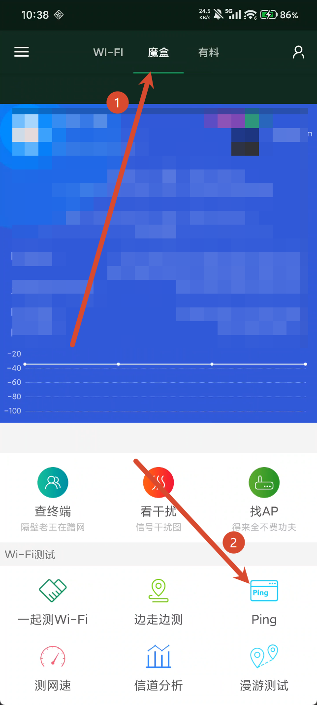
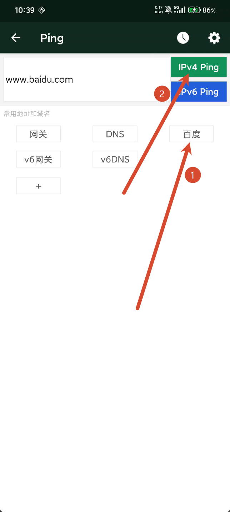

---

## 目录

:::tip
您可以从目录跳转到相应的章节学习以节省您的时间，将您的宝贵的时间用于游戏中
:::

1. [如何检查服务器状态](#如何检查服务器状态)
2. [为什么服务器可以使用但是还很卡](#为什么服务器可以使用但是还很卡)
3. [运营商qos](#运营商qos)

---

### 如何检查服务器状态

---

#### 在astral-game中，有四种服务器状态，分别是：

- 🟢绿色：服务器在线（**但不一定能用**）
- 🔵蓝色：服务器使用中（**但不一定能用**）
- 🔴红色：服务器离线
- ⚪灰色：服务器状态未知（**在右侧启用服务器以检查状态**）

:::important
astral的服务器状态检测**仅供参考**，不可以作为**可使用**或者**能流畅联机**的依据，**请点击创建房间查看是否有ip来决定服务器是否可用**，关于是否能流畅联机看[这里](#为什么服务器可以使用但是还很卡)
:::

---

#### 你可以使用icmp协议（也就是ping命令）来检查服务器是否在线

1. 按住**windows键**（也叫**win键**）然后按**R键**在**左下角弹出的窗口中**输入**cmd**，会弹出来一个黑色的命令提示框

```md
cmd
```

2. 随后输入**ping 服务器ip**（注意ping后面有一个空格，并且无需添加后缀端口），来检测服务器是否在线，**注意以下为示例**

```md
ping www.baidu.com
```

:::important
最后服务器是否可用取决于在astral房间中是否能拿到ip地址
:::

---

### 为什么服务器可以使用但是还很卡

:::important
网络卡顿的原因多种多样，你需要使用ping命令来检查自身网络是否正常
:::

1. [电脑端检测](#电脑端检测)
2. [手机端检查](#手机端检测)

---

#### 电脑端检测

1. 按住**windows键**（也叫**win键**）然后按**R键**在**左下角弹出的窗口中**输入**cmd**，会弹出来一个黑色的命令提示框

```md
cmd
```

2. 随后在任意一个命令提示框中输入以下命令,**正常的延迟应该在30ms以内**，如果高于这个延迟请优化自身网络环境以提升联机体验

```md
ping www.baidu.com -t
```

:::tip
你可以通过使用有线网络，或者来到离路由器，基站等距离近遮挡少的地方来改善网络环境
:::

:::important
使用**热点**的网络容易受到**基站接入人数**和[qci等级](https://zhuanlan.zhihu.com/p/1978134485263472065)以及**外围环境**的影响，**不建议使用这种不稳定的网络进行游戏联机**；使用**广电网络等三大运营商（电信，联通，移动）之外的网络**或者**校园网**的用户在**晚高峰**（即晚上7点到11点）可能会出现严重的[运营商qos](#)，**建议换运营商或者避免使用校园网**
:::

---

#### 手机端检测

1. 下载[WiFi魔盒](https://wis.ruijie.com.cn/wmg/static/homepager/index.htm)或者支持ping功能的软件，这里以**WiFi魔盒**为例，点击上方的**魔盒**，然后点击右下角的**ping**



2. 在打开的页面中点击**百度**，然后点击**IPv4 Ping**开始测试，**正常的延迟应该在50ms以内**，如果高于这个延迟请优化自身网络环境以提升联机体验



:::important
使用**移动数据**的网络容易受到**基站接入人数**和[qci等级](https://zhuanlan.zhihu.com/p/1978134485263472065)以及**外围环境**的影响，不建议使用这种不稳定的网络进行游戏联机；使用**广电网络等三大运营商（电信，联通，移动）之外的网络**或者**校园网**的用户在**晚高峰**（即晚上7点到11点）可能会出现严重的[运营商qos](#运营商qos)，**建议换运营商或者避免使用校园网**
:::

:::tip
使用[itdog网站](https://www.itdog.cn/tcping/)进行tcping，在**晚高峰**（即晚上7点到11点）使用**持续测试**模式在一百个发包中只有不到5个丢包**则视为稳定服务器**
:::

---

### 运营商qos

:::important
运营商qos是影响联机的致命原因，造成这样的最主要的原因是[运营商省间结算](https://zhuanlan.zhihu.com/p/708190780)，其次是[PCDN](https://zhuanlan.zhihu.com/p/10213902019)
:::

---

#### 解决方法

1. 如果你处于**直连模式**，出现**延迟高**，或者有**丢包**，你可以在**设置**中往下滑，找到**禁用p2p**功能并**打开**，这样流量将会**通过服务器中转**，以**减轻运营商qos**

:::important
**该功能仅卡顿的房员开启即可**
:::

2. 如果你已经处于**中转模式**，出现**延迟高**，或者有**丢包**，请在服务器页面中**更换服务器**，因为你可能选择了**不可中转**的服务器，或者**服务器使用人数过多**导致卡顿

:::tip
如果你更换了多个服务器但还是仍然卡顿，你可以尝试[自建服务器](https://acg-n.cn/posts/自建服务器/)
:::

---

> ## 🌟 Thanks for Reading
>
> **文章作者：** `xiaowuliao`  
> **网站作者：** `kevin`
>
> 感谢你的阅读与支持！
>
> 希望这篇 Astral 联机教程能够对你有所帮助。  
> 如果你在使用过程中遇到问题，欢迎反馈与交流。
>
> **感谢阅读 · 祝你联机愉快！** 🎮
>
> ---
>
> *Made with ❤️ by xiaowuliao · Website by kevin*

---

## 便携跳转

1. [AstralGame使用教程](https://acg-n.cn/posts/AstralGame使用教程/)
2. [如何检查服务器在线状态和为什么联机很卡](https://acg-n.cn/posts/如何检查服务器在线状态和为什么联机很卡/)
3. [MC联机教程](https://acg-n.cn/posts/MC联机教程/)
4. [Raft联机教程](https://acg-n.cn/posts/Raft联机教程/)
5. [自建服务器](https://acg-n.cn/posts/自建服务器/)

---